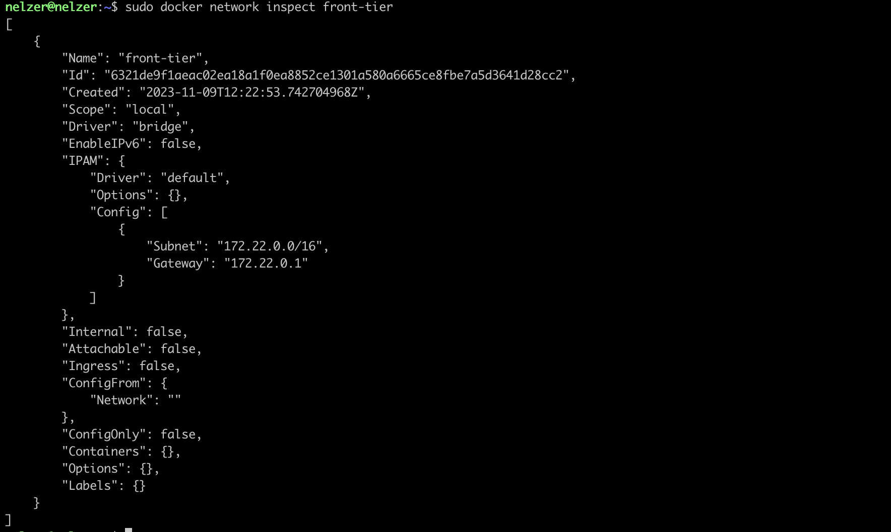
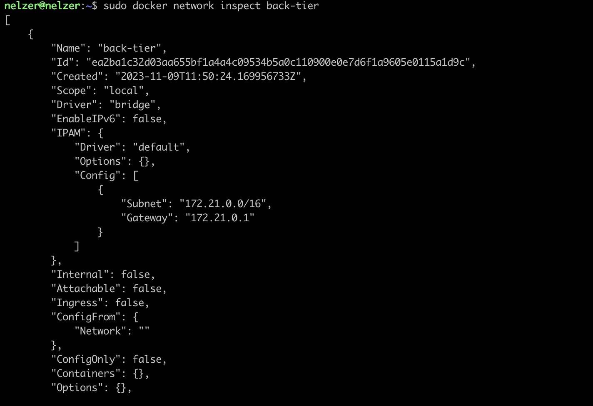
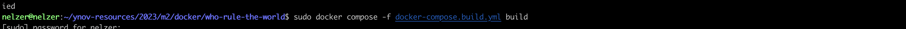
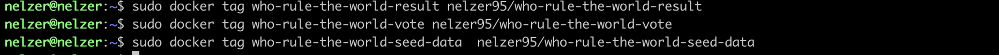
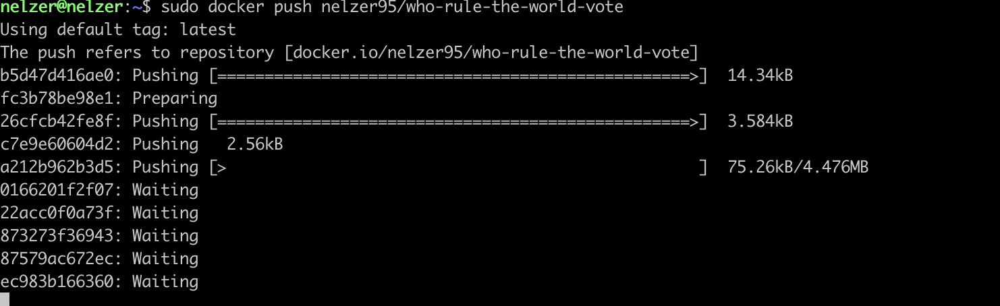
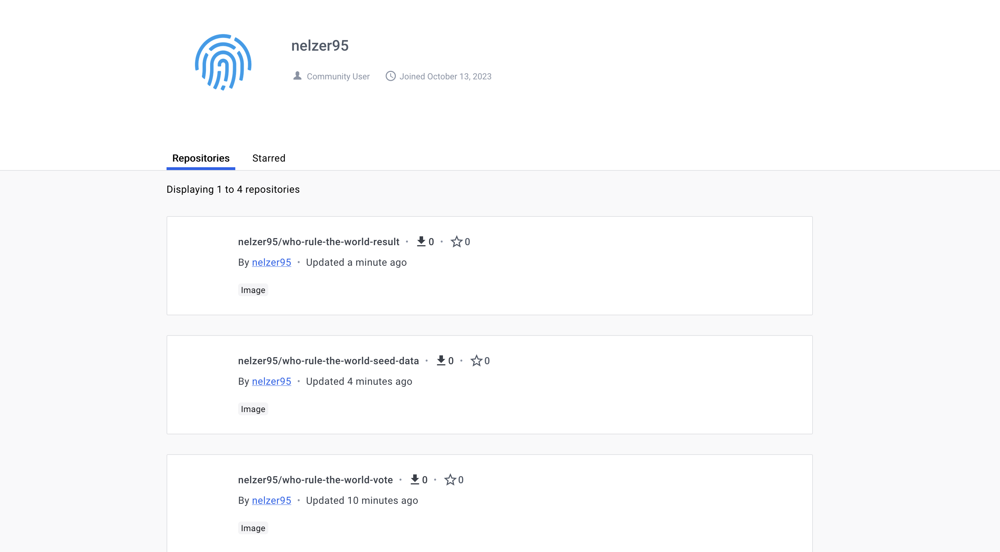

# ynov-resources
This repository is resources for teaching at Ynov School

# [CAT/DOG]

## Description
Site pour voté entre chat ou chien pour savoir qui va conquerir le monde.

## Table des matières
1. [Groupe](#Groupe)
2. [ajout du network et registry](#network-registry)
3. [création et build des Dockerfiles](#build-Dockerfiles)
4. [ajout sur le registry](#Addregistry)
5. [sreen dockerhub image](#imagedockerhub)
6. [Licence](#licence)

## Groupe 

1. Enzo SABBATORSI
2. Carnel MEGBLETO
3. Omaima BELMADKOUR

## network-registry
screen de la création du réseau :

screen de la création du registry :

## build-Dockerfiles
commande pour build les dockerfiles :

## Addregistry
tag les images : 

push les images : 

## imagedockerhub

screen dockerhub des images :

